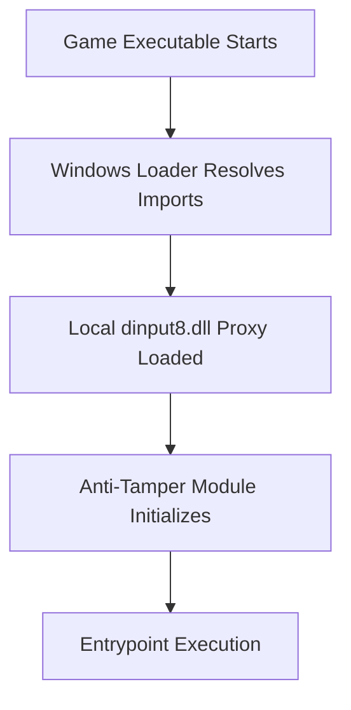

## Introduction

This project explores runtime memory inspection and modification as a way to better understand how protected usermode applications defend against tampering and reverse engineering.

The target environment was a 32-bit game client commonly used in private server ecosystems. These clients often include lightweight anti-tamper protections designed to prevent memory editing and unauthorized modification. Studying these mechanisms provided a practical case study in Windows internals, debugging, and reverse engineering.

This work was performed purely for educational purposes in an isolated environment.

The primary goals of the project were:

- understanding common usermode protection techniques
- reverse engineering 32-bit binaries and DLL modules
- analyzing detection surfaces used by anti-tamper logic
- building tooling to safely inspect and manipulate runtime memory

---

## Tools Used

- **C++** – runtime tooling and API hooking implementation
- **Cheat Engine** – rapid memory exploration, prototyping and debugging
- **Windows API** – process interaction and memory operations


## Step 1. Observing the Module Loading Mechanism

One of the first observations was how the anti-tamper module is introduced into the game process.

The original game client is a compiled binary which relies on a commonly imported system library (`dinput8.dll`). Because Windows resolves DLLs using a predictable search order, placing a proxy DLL module alongside the executable allows it to be loaded before the system version.

This mechanism is frequently used both by legitimate software (plugins, overlays) and by protection systems. From a reverse engineering perspective, it provides a clean entry point into process initialization and early runtime behavior.

Understanding the loader sequence was important because it revealed:

- when protection code initializes
- what APIs are wrapped or monitored
- which memory regions are validated early in startup

This stage established the execution timeline of the defensive logic.



## Step 2. Observing Protection Mechanisms

To observe the different protections used, i started observing memory with Cheat Engine, placing breakpoints at common windows API's.

---

### Process Detection

The protection module also scanned for suspicious processes and tooling typically associated with memory inspection.

This detection relied on:

- enumerating running processes
- checking window titles
- comparing against known tool signatures

While straightforward, this illustrates a common defensive pattern: raising the cost of analysis rather than making it impossible.

---
# Memory Integrity Checks

The client performed periodic integrity verification on selected memory regions. These checks compare runtime memory against expected values to detect modification.

A simplified model of the logic looked like:

```pseudo
expected = checksum(original_region)
current  = checksum(runtime_region)

if current != expected:
    trigger_protection()
```

In practice, the implementation used lightweight hashing and scattered validation routines instead of a single centralized check. This distribution makes static detection harder and complicates naive patching attempts.

Tracing cross-references in IDA helped map where these routines were called and how frequently validation occurred.

---

### Anti-Debugger Checks

Several debugger detection strategies were present, including:

- inspection of process flags
- timing checks
- API-based debugger queries
- exception-based behavior differences

Individually, these checks were simple. Their effectiveness came from layering multiple signals rather than relying on a single detection vector.

Dynamic tracing showed that many checks were defensive rather than aggressive — they altered execution paths instead of immediately terminating the process. This made behavioral analysis especially important.


## Bypass Analysis (Research Perspective)

The goal of bypassing these protections was not exploitation, but understanding their assumptions and failure points.

Studying bypasses reveals how defensive systems can be strengthened.

### Controlled DLL Injection

Because the protection relied on predictable DLL loading behavior, replacing the sideloaded module with an instrumented version allowed controlled observation of initialization routines.

This enabled:

- logging of protection calls
- tracing integrity checks
- mapping API usage
- isolating defensive logic

The focus was instrumentation, not removal.

---

### API Hooking

Hooking selected Windows APIs made it possible to observe how the client validated memory and detected tools.

This approach functioned as a diagnostic layer:

- capturing arguments
- tracking call frequency
- identifying sensitive execution paths

Rather than blindly patching code, hooks acted as runtime probes.

---

### Integrity Check Neutralization

Once integrity routines were mapped, their structure revealed predictable patterns and shared helper functions.

Neutralizing these checks demonstrated an important lesson:

> defensive code that assumes static execution environments is fragile under dynamic instrumentation.

This section of the research highlighted how distributed validation can still be correlated through behavioral analysis.

---

## Key Takeaways

This project reinforced several important principles:

- usermode protections raise effort, not absolutes
- layered defenses are more effective than single checks
- instrumentation is often more powerful than patching
- dynamic analysis reveals design assumptions
- defensive systems must assume hostile environments

Most importantly, it demonstrated how reverse engineering is a dialogue between attacker and defender models. Understanding both perspectives leads to stronger software design.
